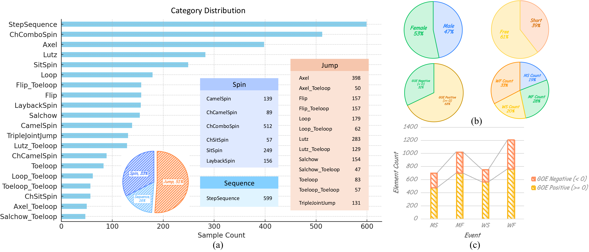
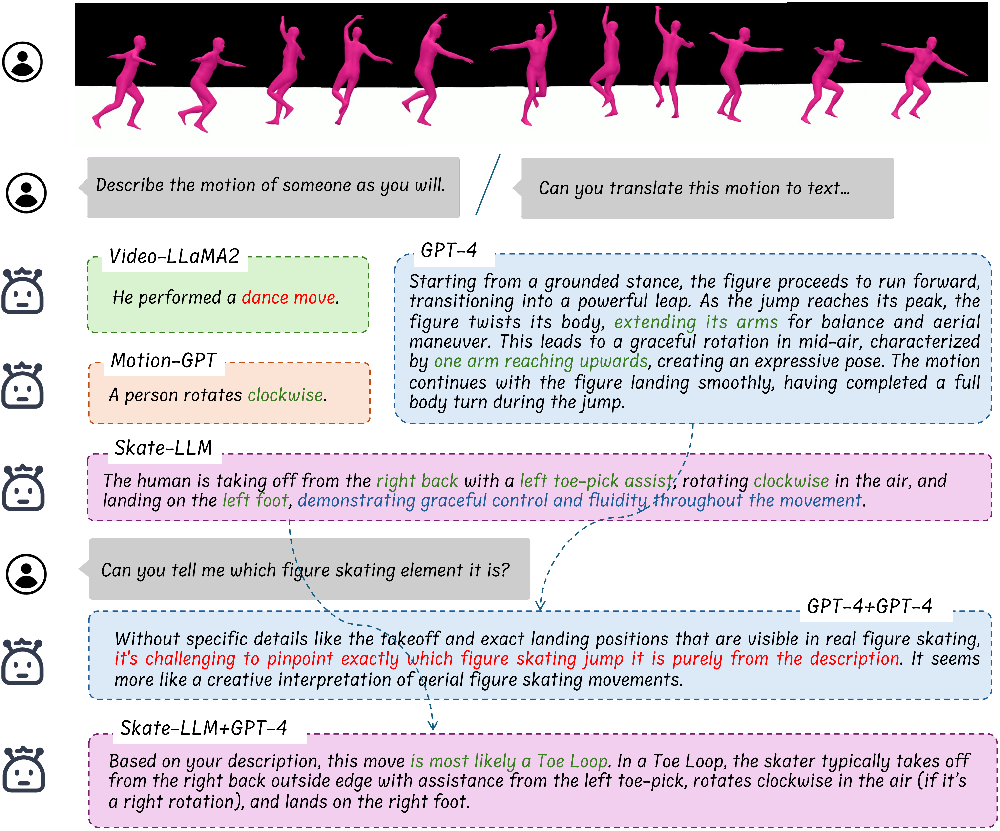

# FSBench

# 📰 News

- **[2025-05-16]: We have temporarily stopped access to FSBench via Google Drive and will release new methods for accessing data and annotations soon.**
- **[2024-11-01]: FSBench is now available at [Google Drive]**

# ✏️ Abstract

Figure skating, known as the Art on Ice is among the most artistic sports, challenging to understand due to its blend of technical elements (like jumps and spins) and overall artistic expression. Existing figure skating datasets mainly focus on single tasks, such as action recognition or scoring, lacking comprehensive annotations for both technical and artistic evaluation. Current sports research is largely centered on ball games, with limited relevance to artistic sports like figure skating. To address this, we introduce FSAnno, a large-scale dataset advancing artistic sports understanding through figure skating. FSAnno includes an open-access training and test dataset, alongside a benchmark dataset, FSBench, for fair model evaluation. FSBench consists of FSBench-Text, with multiple-choice questions and explanations, and FSBench-Motion, containing multimodal data and Question and Answer (QA) pairs, supporting tasks from technical analysis to performance commentary. Initial tests on FSBench reveal significant limitations in existing models’ understanding of artistic sports. We hope FSBench will become a key tool for evaluating and enhancing model comprehension of figure skating.

# 📝 Dataset Statistics and Properties

Our FSAnno contains 783 figure skating videos from the Junior Grand Prix 2023 and ISU GP Skate America 2023. The dataset provides not only the figure skating performance videos but also highlights replay videos and audio from the results waiting period, which includes commentary by announcers. The videos are processed to be identity-free and are available in two different modalities: motion and skeleton. The average duration of the short program videos is 2 minutes and 52 seconds, while the free skating videos average 4 minutes and 13 seconds in length.

# ⛸️ SkateLLM
Compared to other large language models, SkateLLM's descriptions of figure skating elements are more focused on the technical movements themselves and artistic evaluations. Additionally, based on the more professional captions it generates, other LLMs (such as GPT-4) have a higher probability of correctly inferring the category of the element.

